# Diagramas del Sistema KilomboCRM

Este documento contiene los diagramas visuales que representan la arquitectura y flujos del sistema.

## 1. Arquitectura en Capas

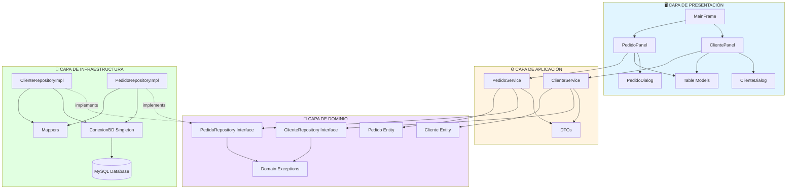

## 2. Flujo de Creación de Cliente

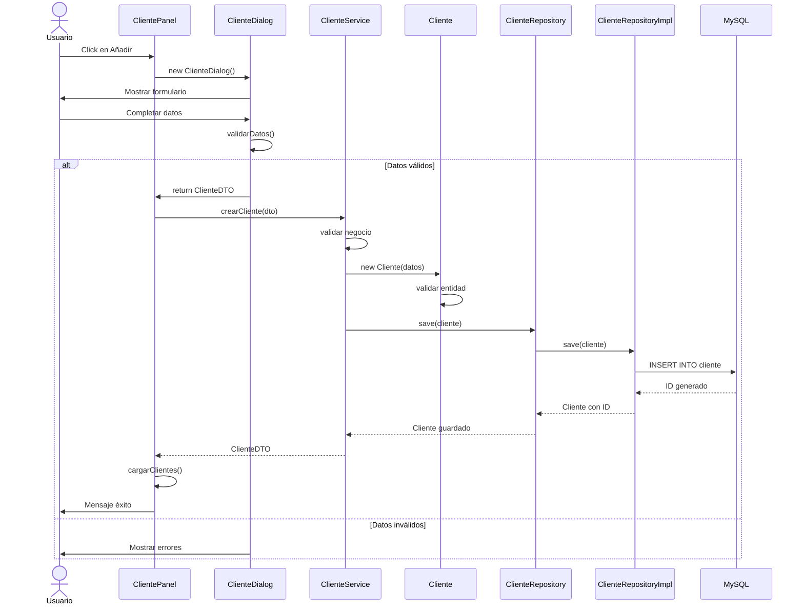

## 3. Flujo de Consulta de Pedidos por Cliente

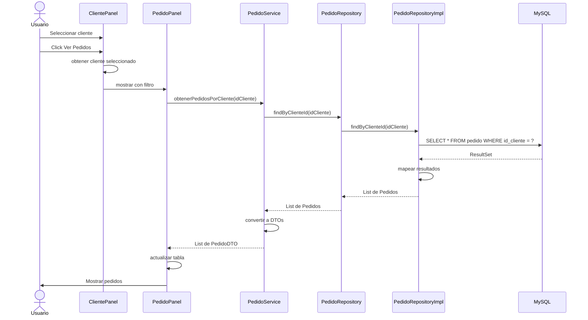

## 4. Modelo de Datos

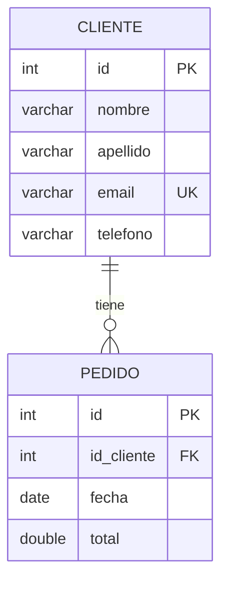

## 5. Diagrama de Clases - Dominio

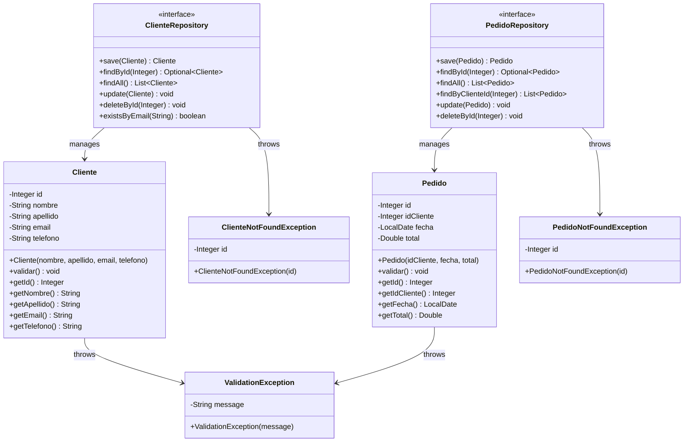

## 6. Diagrama de Clases - Aplicación

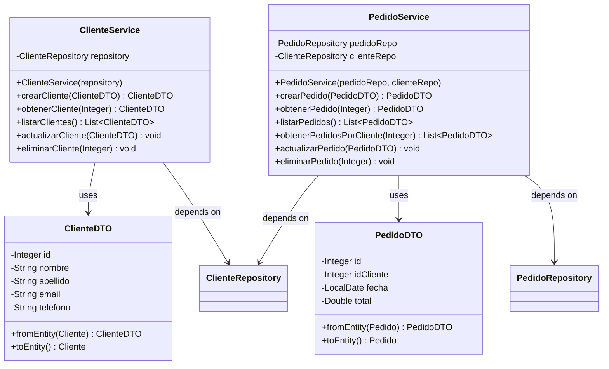

## 7. Diagrama de Clases - Infraestructura

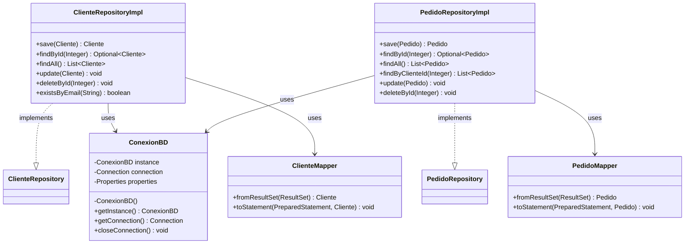

## 8. Diagrama de Componentes UI

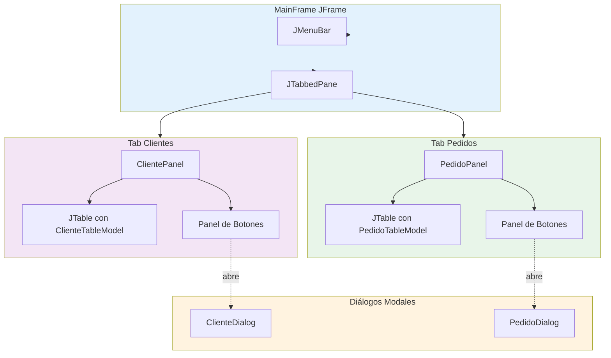

## 9. Flujo de Manejo de Excepciones

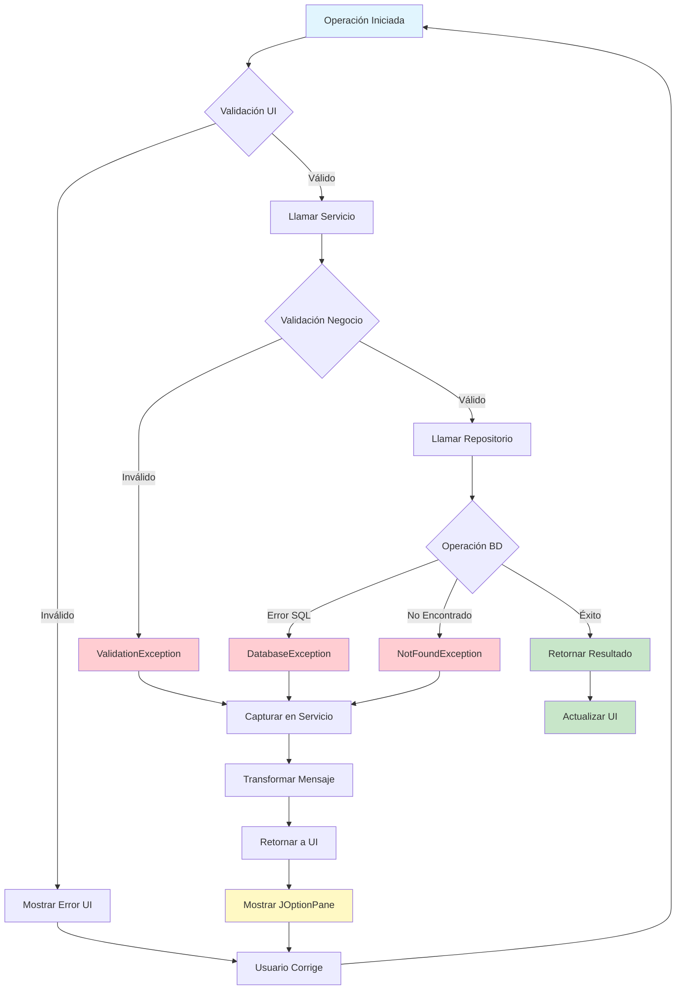

## 10. Patrón Singleton - ConexionBD

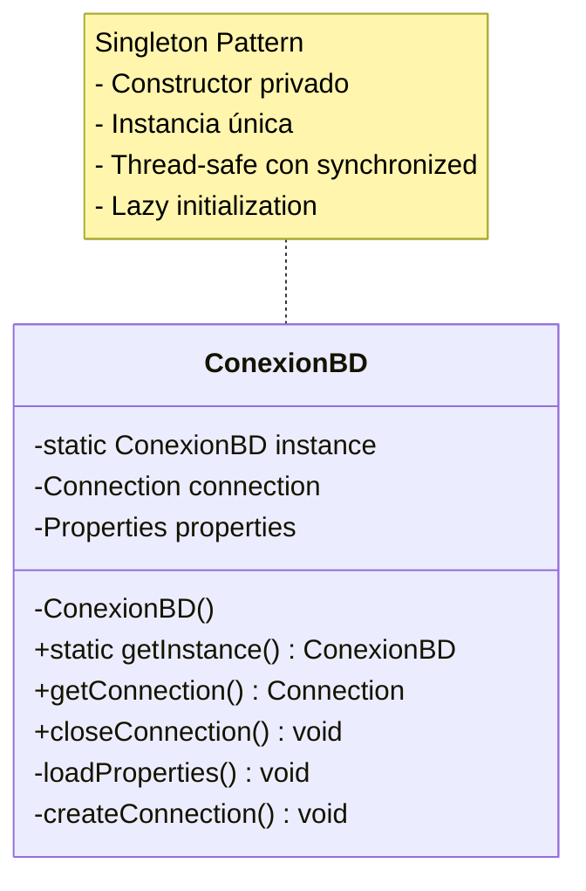

## 11. Ciclo de Vida de una Transacción

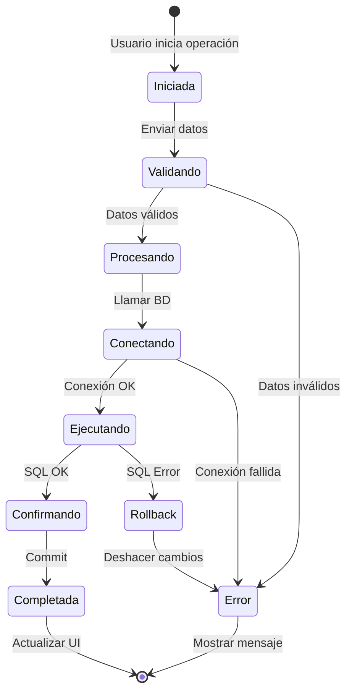

## 12. Estructura de Paquetes

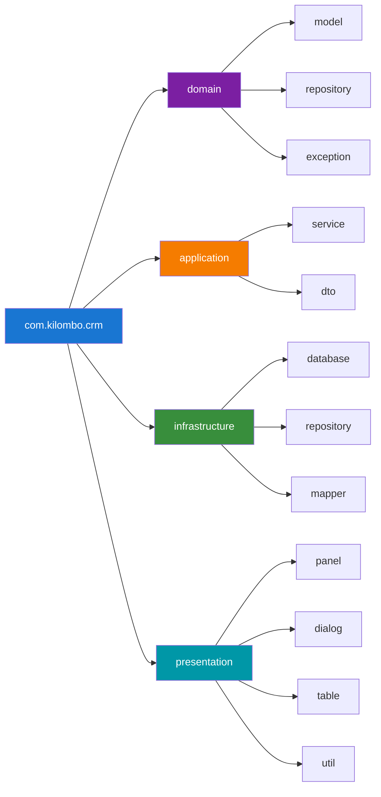

## 13. Dependencias entre Capas

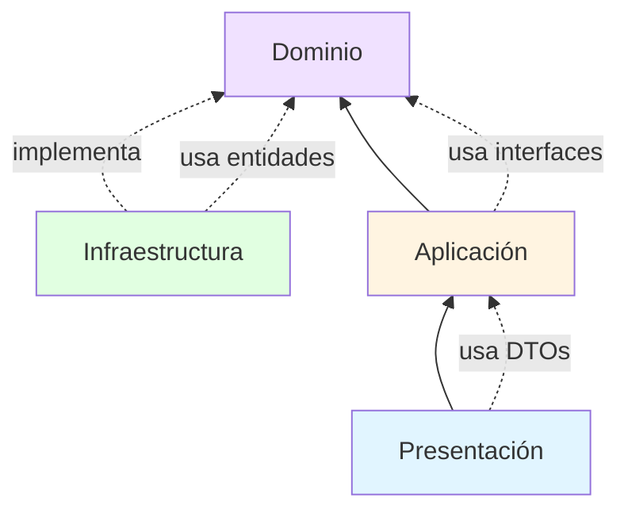

## Conclusión

Estos diagramas proporcionan una visión completa de:
- ✅ La arquitectura en capas del